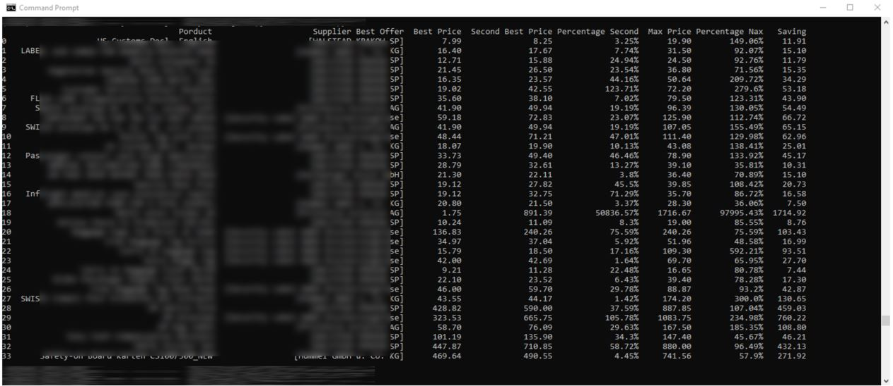

Script chooses the best price for a random number of products based on offers given by a random number of suppliers. Script also handles situation where there are suppliers that don't offer a specific product. Best price, second best offer being percentage of the best price, max price, savings, product names and suppliers come with the final reported result.

Data income: 
cvs file

Outcome:

